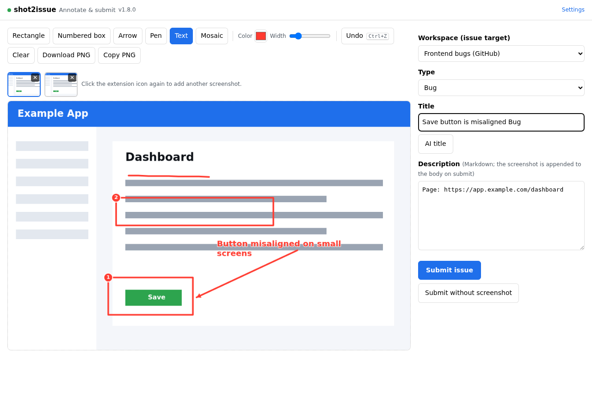
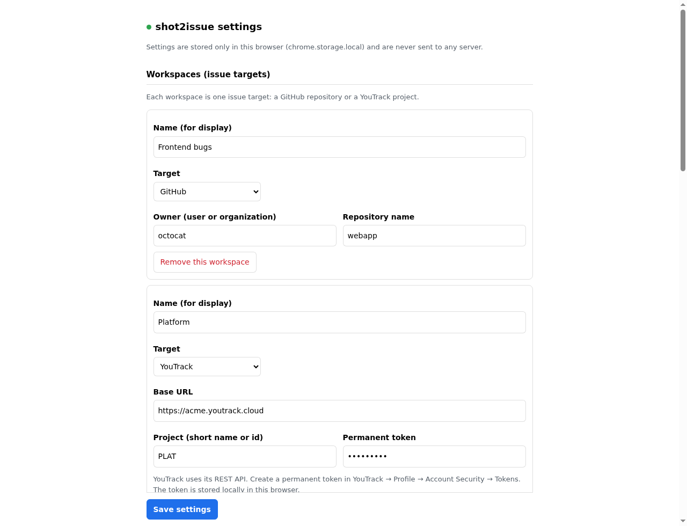
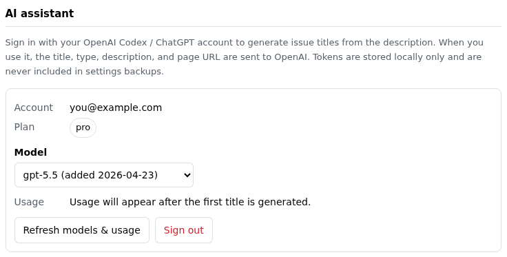

# shot2issue

[English](README.md) | [简体中文](README.zh-CN.md) | **日本語**

スクリーンショットから GitHub または YouTrack の issue を作成する Chrome 拡張機能（Manifest
V3）です。ツールバーのアイコンをクリックすると現在のタブを撮影し、注釈を加え、タイトルと説明を
入力して送信できます。スクリーンショットは issue に添付され、インライン表示されます。

本拡張機能はクライアントサイドのみで動作し、サードパーティのサーバーとは通信しません。GitHub
への送信に Personal Access Token は不要で、現在の github.com のブラウザセッションを利用します。
YouTrack への送信には、指定した永続トークンで REST API を使用します。

本拡張機能は TypeScript で書かれており、読み込み可能な拡張機能を生成するにはビルドが必要です。

<p align="center">
  
</p>

## スクリーンショット

エディタ —— スクリーンショットに注釈を付けて送信：



設定 —— GitHub と YouTrack のワークスペースを設定：



AI アシスタント —— ChatGPT サブスクリプションでサインインしてタイトルを生成：



## 機能

- 現在のタブの表示領域をワンクリックで撮影。
- 1 つの issue に複数のスクリーンショット：撮影するたびにサムネイルが追加され、それぞれ注釈・切り替え・削除でき、送信時にすべて添付されます。エディタを開いたまま拡張機能アイコンを再度クリックすると、新しいスクリーンショットが追加されます。
- Canvas による注釈：矩形、番号付き枠（自動採番バッジ）、矢印、フリーハンドのペン、サイズ変更可能で自動折り返しするテキスト枠、機密情報を伏せるモザイク。Ctrl/Cmd+Z で元に戻し、Esc を 2 回押すとエディタを閉じます。
- 注釈付き画像は PNG としてダウンロード、またはクリップボードへ直接コピーできます。
- 既定のタイトル・本文テンプレートを事前設定可能（プレースホルダー {pageTitle}、{pageUrl}、{type}）。
- 任意の AI アシスタント：OpenAI Codex / ChatGPT サブスクリプションのアカウントでサインインすると、
  説明から issue のタイトルを生成し、利用可能なモデルと使用状況を確認できます。
- 複数のワークスペースに対応。各ワークスペースは 1 つの送信先（GitHub リポジトリまたは YouTrack
  プロジェクト）を対象とします。
- GitHub への送信はバックグラウンドのタブで行われ、フォーカスを奪いません。送信後にエディタを
  閉じて撮影元のページに戻る挙動も選択できます。
- 現在のタブを撮影する任意のキーボードショートカット（既定では無効）。
- インターフェースは英語・簡体中文・日本語に対応（既定は英語）。
- バックエンドなし、解析・トラッキングなし。設定はローカルにのみ保存され、書き出しも可能です。

## 動作要件

- Manifest V3 に対応した Google Chrome（または Chromium 系ブラウザ）。
- GitHub 送信先：同じブラウザで github.com にサインインし、対象リポジトリ（非公開を含む）に
  アクセスできるアカウントであること。
- YouTrack 送信先：インスタンスの Base URL、プロジェクト、永続トークン。

## インストール

1. 本リポジトリをクローンまたはダウンロードします。
2. 拡張機能をビルドします（[ビルド](#ビルド)を参照）。

   ```bash
   npm install
   npm run build
   ```

   これにより `build/` ディレクトリが生成されます。
3. `chrome://extensions` を開きます。
4. 右上の「デベロッパーモード」を有効にします。
5. 「パッケージ化されていない拡張機能を読み込む」を選び、**`build/`** ディレクトリ（`extension/`
   ではなくなりました）を指定します。
6. 初回インストール時に設定ページが開きます。ワークスペースを少なくとも 1 つ追加してください。

開発時は `npm run watch` で変更を自動的に再コンパイルし、変更を反映するには
`chrome://extensions` の拡張機能カードにある「更新」ボタンを押します。

ビルド成果物（`dist/shot2issue-<version>.zip`、[ビルド](#ビルド)を参照）も同じ方法で読み込めます。
Chrome Web Store へのアップロードにも使用できます。

新しいコードを取得した後は、再ビルドしてから `chrome://extensions` の拡張機能カードにある「更新」
ボタンを使って更新します。更新では設定は保持されます。拡張機能を削除すると設定は消去されます。

## 使い方

1. 撮影したいページを開き、shot2issue のツールバーアイコンをクリックします。表示領域が撮影され、
   新しいタブでエディタが開きます。
2. エディタでワークスペースと種類を選び、スクリーンショットに注釈を加え、タイトルと説明を編集します。
   タイトルの既定値は「ページタイトル + 選択した種類」、本文の既定値はページ URL です。
3. 「issue を送信」をクリックします。拡張機能が対象リポジトリの新規 issue ページをバックグラウンドで
   開き、スクリーンショットをアップロードし、フォームを入力して送信します。成功すると issue への
   リンクが表示されます（有効にしている場合は撮影元のページに戻ります）。

送信に失敗した場合は、「PNG をダウンロード」で注釈付き画像を保存して手動で添付するか、「スクリーン
ショットなしで送信」で画像を添付せずに issue を作成できます。

## 設定

設定ページは `chrome://extensions`（詳細 → 拡張機能のオプション）またはエディタの「設定」リンク
から開けます。

- **ワークスペース** —— 各ワークスペースは 1 つの送信先です。GitHub：表示名・owner（ユーザーまたは
  組織）・リポジトリ名。YouTrack：表示名・Base URL・プロジェクト（短縮名または id）・永続トークン
  （YouTrack → プロフィール → Account Security → Tokens で作成）。トークンはこのブラウザ内にのみ
  保存されます。
- **種類** —— エディタの「種類」ドロップダウンに表示され、既定タイトルに使われます。既定値：
  Change、Bug、Feature。
- **言語** —— 英語、簡体中文、または日本語。
- **既定のタイトルと本文** —— 新規 issue を事前入力するテンプレート。プレースホルダー：
  `{pageTitle}`、`{pageUrl}`、`{type}`。
- **AI アシスタント** —— 任意で OpenAI Codex / ChatGPT のアカウントでサインインしてタイトルを生成
  できます。下記の [AI アシスタント](#ai-アシスタント) を参照してください。
- **動作** —— 送信成功後にエディタを閉じて撮影元のページに戻るかどうか。
- **キーボードショートカット** —— 任意でキーボードショートカットから撮影できます。既定では無効です。
  ここで有効化したうえで、Chrome のショートカットページ（`chrome://extensions/shortcuts`、「ショートカットを
  設定」ボタンで開きます）でキーの組み合わせを割り当てます。
- **バックアップ / 復元** —— 設定を JSON ファイルに書き出し、後で読み込めます。設定はこのブラウザ内
  （`chrome.storage.local`）にのみ保存されます。

## 送信の仕組み

### GitHub

GitHub の issue 添付（`user-attachments/assets`）には公式 API がありません。Personal Access Token、
OAuth、GitHub App ではアップロードできず、github.com のウェブセッションのみが可能です。そのため本
拡張機能は、対象リポジトリの新規 issue ページ上で「人による操作」を再現します。

1. `https://github.com/<owner>/<repo>/issues/new` をバックグラウンドのタブで開きます。
2. `chrome.scripting.executeScript`（ページの main world）でスクリプトを注入し、タイトルと説明を入力
   して本文にスクリーンショットを貼り付けます。アップロードは GitHub 自身のページコードが実行する
   ため真に same-origin となり、verified-fetch のチェックを通過し、`` の markdown が挿入され
   ます。
3. アップロード完了を待ってから「Create」をクリックします。
4. 生成された issue の URL を取得し、バックグラウンドのタブを閉じます。

この方法しか取れない理由は 2 つあります。

- 拡張機能から GitHub のアップロードエンドポイントへ送るクロスオリジンのリクエストは same-origin を
  偽装できず、拒否されます（HTTP 422）。
- 添付は「それをアップロードした composer が送信された」ときにのみ正しく関連付けられます。ある場所で
  アップロードし、別の場所（例：REST API で作成した issue）からその URL を参照すると、非公開リポジトリ
  では画像が 404 になります。

スクリーンショットの data URL は `fetch` ではなく `atob` でデコードします。github.com のコンテンツ
セキュリティポリシー（CSP）が `data:` URL の `fetch` をブロックするためです。

このフローは GitHub のウェブ UI の構造に依存しており、UI が変わると更新が必要になる場合があります。
コードでは複数のセレクタ、「貼り付け→ドロップ」のフォールバック、明示的なタイムアウトを用いています。
「PNG をダウンロード」と「スクリーンショットなしで送信」は常にフォールバックとして利用できます。

### YouTrack

YouTrack は issue 作成と添付の両方に文書化された REST API を提供しているため、このパスでは永続
トークンで API を直接利用します。issue を作成し（`POST /api/issues`）、スクリーンショットを
アップロードして（`POST /api/issues/{id}/attachments`）ファイル名でインライン埋め込みします。
インスタンス URL は事前に分からないため、各インスタンスへの初回送信時にそのオリジンへのアクセス
許可を求めます。

## AI アシスタント

任意の AI アシスタントは OpenAI Codex / ChatGPT サブスクリプションのアカウントでサインインし
（OAuth、PKCE）、説明から issue のタイトルを生成し、利用可能なモデルと使用状況を表示します。従量
課金の API キーではなく、お使いのサブスクリプションを利用します。

Codex の標準的な OAuth は `http://localhost:1455` のコールバックを使用しますが、ブラウザ拡張機能は
そこを待ち受けできません。そのため 2 つのサインイン経路を用意しています。

1. **自動** —— 拡張機能自身の `https://<id>.chromiumapp.org/` リダイレクトを用いる
   `chrome.identity.launchWebAuthFlow`。これは、OpenAI が公開 Codex クライアントに対してその
   リダイレクト URI を受け付ける場合にのみ機能します。
2. **手動（リンクを貼り付け）** —— フォールバックとして使用します。拡張機能は Codex の localhost
   リダイレクトで認可ページを開きます。サインイン後、ブラウザはアドレスに `?code=…` を含む
   「localhost に到達できません」ページに移動します。そのアドレス全体をコピーして貼り付けると、
   拡張機能自身が PKCE のトークン交換を完了します。

「ChatGPT でサインイン」をクリックすると、まず自動経路を試み、自動的に手動経路へフォールバックします。
その後、エディタの「AI タイトル」が、現在の種類、ページタイトル、ページ URL、説明、および
スクリーンショットからタイトルを生成します。モデル一覧は Codex models エンドポイントから動的に取得
します（組み込みのフォールバックあり）。生成に使うシステムプロンプトは設定で編集でき、「既定の
プロンプトに戻す」ボタンで現在のインターフェース言語の既定値にリセットできます。

> 注意：本アシスタントは変更される可能性のある文書化されていない `chatgpt.com` のエンドポイントと
> 通信し、お使いのアカウントに対する OpenAI の規約が適用されます。トークンは `chrome.storage.local`
> にのみ保存され、設定のバックアップには一切含まれません。

## 権限

| 権限 | 用途 |
| --- | --- |
| `activeTab` | アイコンのクリック時に付与。表示中のタブを撮影し、タイトルと URL を読み取るために使用。 |
| `storage` | 設定を `chrome.storage.local` に、保留中のスクリーンショットを `chrome.storage.session` に保存。 |
| `scripting` | バックグラウンドの github.com タブに送信用スクリプトを注入。 |
| `identity` | AI アシスタントの OAuth サインイン（`launchWebAuthFlow`）を実行。アシスタントを接続した場合にのみ使用。 |

既定のホスト権限は `https://github.com/*` のみで、GitHub 送信時の唯一の通信先です。スクリーン
ショットのバイト列は GitHub 自身のページコードがそのストレージへアップロードするため、拡張機能は
それらのストレージホストの権限を必要としません。

YouTrack のインスタンス URL は事前に分からないため、`optional_host_permissions` として宣言し、
実行時に要求します。あるインスタンスに初めて保存または送信するとき、Chrome がそのオリジンへの
アクセス許可を求めます。AI アシスタントも同様に、接続するときに `https://auth.openai.com/*` と
`https://chatgpt.com/*` を要求します。

## プライバシー

- 使用するのはスクリーンショット、タイトル、説明、現在のページ URL のみです。コンソール出力、ネット
  ワーク活動、デバイス情報は収集せず、テレメトリも含みません。
- AI アシスタントは接続するまで無効です。「AI タイトル」を使用すると、種類、説明、ページ URL、
  および現在の（注釈付き）スクリーンショットが、タイトルを生成するために OpenAI へ送信されます。その
  トークンは `chrome.storage.local` にのみ保存され、設定のバックアップから除外されます。
- 添付の公開範囲はリポジトリの公開範囲に従います。非公開リポジトリの添付は閲覧にサインインが必要です
  （2023-05 以降）。公開リポジトリの添付は匿名で閲覧できます。対象リポジトリは用途に応じて選んでください。
- モザイクツールは伏せ字に使えます。送信前に機密情報を覆ってください。元のスクリーンショットを
  サンプリングし、選択した領域をピクセル化します。
- GitHub 送信ではトークンを保存せず、既存の github.com セッションに依存します。YouTrack の永続
  トークンはこのブラウザ内（`chrome.storage.local`）にのみ保存されます。

## プロジェクト構成

```
shot2issue/
├── src/                          # TypeScript ソースと静的アセット
│   ├── manifest.json            # MV3 マニフェスト。github.com ホスト権限 + 任意の YouTrack オリジン
│   ├── background.ts            # service worker：アイコン/ショートカットで撮影しエディタを開く
│   ├── editor.ts / .html / .css # メイン UI：選択、Canvas 注釈、送信
│   ├── options.ts / .html       # 設定：ワークスペース、種類、言語、ショートカット、バックアップ
│   ├── lib/
│   │   ├── storage.ts           # chrome.storage アクセス（設定 + 保留中のスクリーンショット）
│   │   ├── i18n.ts              # インターフェース文字列（en / zh / ja）
│   │   ├── github-attach.ts     # github.com サインイン検出
│   │   ├── page-upload.ts       # GitHub：github.com のウェブフォームによるページ内送信
│   │   ├── youtrack.ts          # YouTrack：REST API による issue 作成と添付アップロード
│   │   └── providers/
│   │       ├── index.ts         # プロバイダーのレジストリ
│   │       ├── types.ts         # Provider インターフェースと共有型
│   │       ├── github.ts        # GitHub プロバイダー
│   │       └── youtrack.ts      # YouTrack プロバイダー
│   └── icons/                   # 16 / 48 / 128 px アイコン
├── scripts/copy-assets.mjs      # 静的アセットを build/ へコピー
├── package.json                 # 依存関係とビルドスクリプト
├── tsconfig.json                # TypeScript コンパイラ設定
├── Dockerfile                   # リリースアーカイブ用の Docker ビルド
├── .github/workflows/build.yml  # CI：Docker ビルド、artifact のアップロード、release への添付
├── LICENSE
└── README.md
```

ビルド出力は `build/` に生成されます（「パッケージ化されていない拡張機能を読み込む」の対象）。
リリース用 zip は `dist/` に出力されます。

## ビルド

「パッケージ化されていない拡張機能を読み込む」には、まず TypeScript をコンパイルする必要があります。

ローカルでビルドする場合：

```bash
npm install && npm run build
# 出力：build/（load unpacked の対象）
```

Docker を使う場合（コマンドは従来どおり）：

```bash
docker build --target export --output type=local,dest=dist .
```

継続的インテグレーション（[`.github/workflows/build.yml`](.github/workflows/build.yml)）は、`main`
へのプッシュ、Pull Request、手動実行のたびに Docker ビルドを実行し、アーカイブを workflow artifact
としてアップロードします。`v*` タグのプッシュでは、アーカイブを GitHub release にも添付します。

```bash
git tag v1.0.0 && git push origin v1.0.0
```

## issue バックエンドの追加

送信先のバックエンドはプロバイダーとして実装されています。新しいバックエンドを追加するには、
`src/lib/providers/types.ts` の `Provider` インターフェースを実装します。`src/lib/providers/` に
新しいモジュールを作成し、`src/lib/providers/index.ts` のレジストリに登録してください。エディタと
設定ページは登録済みのプロバイダーからフィールドと送信ロジックを取得します。

## 制限事項

- 表示領域のみを撮影します。ページ全体やスクロールを伴う撮影には対応していません。
- `chrome://` や Chrome Web Store などの制限付きページは撮影できません。エディタがその旨を表示します。
- ラベルの自動設定は行いません。
- 送信フローは GitHub の現在のウェブ UI に依存しており、UI の変更時に更新が必要になる場合があります。

## ライセンス

[MIT](LICENSE)
