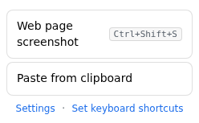

# shot2issue

**English** | [简体中文](README.zh-CN.md) | [日本語](README.ja.md)

A Chrome extension (Manifest V3) for filing GitHub, GitLab, or YouTrack issues from a screenshot.
Click the toolbar icon to capture the current tab, annotate the image, write a title and
description, and submit. The screenshot is attached to the issue and rendered inline.

The extension is written in TypeScript and is client-side only; it talks to no
third-party servers. GitHub submission requires no personal access token — it uses your
existing github.com browser session. YouTrack submission uses its REST API with a
permanent token you provide.

<p align="center">
  
</p>

## Screenshots

Toolbar popup — choose a capture source (each shows its shortcut when set):



Editor — annotate the screenshot and submit:


Settings — accounts and workspaces, organized into tabs:


AI assistant — sign in with a ChatGPT subscription to generate titles:


## Features

- Capture the current tab, or — via the toolbar popup — your whole screen, a specific
  window, or another application (`chrome.desktopCapture`). Each source can be bound to its
  own keyboard shortcut, which is shown in the popup when set.
- Multiple screenshots per issue: each capture adds a thumbnail; annotate each one, switch
  between them, delete any, and they are all attached on submit. Re-clicking the extension
  icon while the editor is open adds the new screenshot to it.
- Canvas annotation: rectangle, numbered box (auto-incrementing badge), arrow, freehand
  pen, wrapping text in a resizable region, and mosaic for redaction. Undo with
  Ctrl/Cmd+Z; close the editor with Esc (pressed twice).
- Save the annotated image: download as PNG or copy it straight to the clipboard.
- Pre-configurable default title and body templates ({pageTitle}, {pageUrl}, {type}).
- Optional AI assistant: sign in with an OpenAI Codex / ChatGPT-subscription account to
  generate an issue title from the description, and view the available models and usage.
- Smart dictation: type a description or dictate it (dictation is transcribed with your
  subscription); the AI writes the issue title and body from it and the screenshots.
- Multiple workspaces, each targeting a GitHub repository, a GitLab project, or a YouTrack
  project. YouTrack/GitLab credentials live on reusable **Accounts** that workspaces share.
- GitHub submission runs in a background tab without stealing focus; the editor can
  optionally close and return you to the page you captured.
- Optional keyboard shortcut to capture the current tab (off by default).
- Interface available in English, Simplified Chinese, and Japanese (English by default).
- No backend and no analytics. Settings are stored locally and can be exported.

## Requirements

- Google Chrome (or a Chromium-based browser) with Manifest V3 support.
- For GitHub targets: an active github.com session in the same browser, signed in to an
  account with access to the target repository (including private repositories).
- For YouTrack targets: the instance base URL, a project, and a permanent token.

## Installation

The extension is written in TypeScript and must be compiled before it can be loaded.

1. Clone or download this repository.
2. Run `npm install`, then `npm run build`. This compiles TypeScript and copies static
   assets into the `build/` directory.
3. Open `chrome://extensions`.
4. Enable **Developer mode** (top right).
5. Choose **Load unpacked** and select the **`build/`** directory (not the repository
   root and not `src/`).
6. The options page opens on first install. Add at least one workspace.

A packaged build (`dist/shot2issue-<version>.zip`, see [Building](#building)) can be
loaded the same way or uploaded to the Chrome Web Store.

To iterate while developing, run `npm run watch`, which recompiles on every change; then
use the **Reload** button on the extension card in `chrome://extensions` to pick up the
new output. Settings are preserved across reloads; removing the extension clears them.

## Usage

1. Open the page you want to capture and click the shot2issue toolbar icon. The visible
   area is captured and the editor opens in a new tab.
2. In the editor, choose a workspace and type, annotate the screenshot, and edit the
   title and description. The title defaults to the page title followed by the selected
   type; the body is prefilled with the page URL.
3. Click **Submit issue**. The extension opens the target repository's new-issue page in
   a background tab, uploads the screenshot, fills in the form, and submits. On success
   it shows a link to the issue (and, if enabled, returns you to the captured page).

If submission fails, use **Download PNG** to save the annotated image and attach it
manually, or **Submit without screenshot** to file the issue without the image.

## Configuration

Open the options page from `chrome://extensions` (Details → Extension options) or from
the **Settings** link in the editor. Settings are organized into tabs: **Workspaces**,
**Accounts**, **AI**, and **General**.

- **Accounts** — reusable credentials for a YouTrack or GitLab instance: a display name,
  base URL, and a token (YouTrack permanent token, or a GitLab personal access token with
  the `api` scope). Multiple workspaces on the same instance share one account. GitHub
  needs no account (it uses your github.com web session). Accounts are stored locally and
  included in settings backups.
- **Workspaces** — each workspace is one issue target. For GitHub: a display name, owner
  (user or organization), and repository name. For YouTrack/GitLab: a display name, an
  account (picked from the Accounts tab), and the project (YouTrack short name/id, or
  GitLab numeric id or `group/project` path). Legacy YouTrack workspaces that stored their
  credentials inline are migrated to an account automatically.
- **Types** — shown in the editor's Type dropdown and used in the default title.
  Defaults: Change, Bug, Feature.
- **Language** — English, Simplified Chinese, or Japanese.
- **Default title & body** — templates that prefill new issues, with the placeholders
  `{pageTitle}`, `{pageUrl}`, and `{type}`.
- **AI assistant** — optionally sign in with an OpenAI Codex / ChatGPT account to generate
  titles. See [AI assistant](#ai-assistant) below.
- **Behavior** — whether to close the editor and switch back to the captured page after a
  successful submission.
- **Keyboard shortcut** — optionally trigger a capture with a keyboard shortcut. Off by
  default; enable it here, then assign the key combination on Chrome's shortcuts page
  (`chrome://extensions/shortcuts`), which the “Set shortcut” button opens.
- **Backup / restore** — export settings to a JSON file and import them later. Settings
  are stored only in this browser (`chrome.storage.local`).

## How submission works

### GitHub

GitHub issue attachments (`user-attachments/assets`) have no official API: personal
access tokens, OAuth, and GitHub Apps cannot upload them. Only the github.com web
session can. The extension therefore reproduces what a person does manually, on the
target repository's new-issue page:

1. Open `https://github.com/<owner>/<repo>/issues/new` in a background tab.
2. Inject a script (via `chrome.scripting.executeScript` in the page's main world) that
   fills in the title and description and pastes the screenshot into the body. GitHub's
   own page code performs the upload, which is genuinely same-origin and therefore
   passes its verified-fetch checks, and inserts the `` markdown.
3. Wait until the upload has completed, then click **Create**.
4. Read the resulting issue URL and close the background tab.

Two constraints make this the only reliable approach:

- A cross-origin request from the extension to GitHub's upload endpoint cannot forge a
  same-origin context and is rejected (HTTP 422).
- An attachment is associated correctly only when the composer that uploaded it is
  submitted. Uploading in one place and referencing the URL from another (for example,
  an issue created through the REST API) causes the image to return 404 in private
  repositories.

The screenshot's data URL is decoded with `atob` rather than `fetch`, because
github.com's content security policy blocks `fetch` of `data:` URLs.

This path depends on the structure of GitHub's web UI and may need updating if that UI
changes. The code uses several selectors, a paste-then-drop fallback, and explicit
timeouts. The **Download PNG** and **Submit without screenshot** actions remain available
as fallbacks.

### YouTrack

YouTrack provides a documented REST API for both issue creation and attachments, so this
path uses the API directly with your permanent token: the extension creates the issue
(`POST /api/issues`), then uploads the screenshot (`POST /api/issues/{id}/attachments`)
and embeds it inline by file name. The first submission to a given instance prompts for
permission to access that origin, since instance URLs are not known in advance.

### GitLab

GitLab also has a documented REST API. Using the account's personal access token
(`PRIVATE-TOKEN` header, `api` scope), the extension uploads each screenshot to the project
(`POST /api/v4/projects/:id/uploads`), then creates the issue
(`POST /api/v4/projects/:id/issues`) with the returned markdown embedded in the description.
The project is the numeric id or the URL-encoded `group/project` path; self-hosted instances
work via the account's base URL. The first submission to an instance prompts for permission
to access that origin.

## AI assistant

The optional AI assistant signs in with an OpenAI Codex / ChatGPT-subscription account
(OAuth, PKCE) so it can generate an issue title from your description and show the
available models and usage. It uses your subscription rather than a pay-per-use API key.

Codex's OAuth client only registers a `http://localhost:1455` callback (the extension's own
`chromiumapp.org` redirect is rejected with `authorize_hydra_invalid_request`), and an
extension can't listen on localhost. So **Sign in with ChatGPT** opens the authorize page
with that localhost redirect and then:

1. **Automatic** — the extension watches the sign-in tab and, when it navigates to the
   unreachable `http://localhost:1455/auth/callback?code=…`, reads the `?code=` straight
   from the tab's URL (no manual step). This needs host permission for the localhost
   callback, which is requested together with the OpenAI origins when you connect.
2. **Manual (paste link)** — the fallback shown alongside: if you aren't captured
   automatically, copy that “can't reach localhost” address and paste it back, and the
   extension completes the PKCE token exchange itself.

In the editor, **Summarize title** then generates a title from
the current type, page title, page URL, description, and the screenshot. The model list is
fetched dynamically from the Codex models endpoint (with a curated fallback). The system
prompt is editable in Settings, with a **Restore default prompt** button that resets it to
the current interface language's default.

**Smart dictation.** The **Smart dictation** button opens a dialog where you type a
description or dictate it (recording is transcribed with your ChatGPT subscription,
`whisper-1`). The
model then writes a title and a Markdown body from that text, the screenshots, and the page
metadata (structured JSON output), referencing any numbered boxes in the screenshots. The
dialog keeps its content between opens and can generate repeatedly. Note: the transcription
endpoint is a Codex Desktop route that is undocumented and accepts only the ChatGPT session
token (not an API key), so dictation is best-effort and may change (typing always works).
Capture failures (including screen capture) are shown as a system notification. Like the
title prompt, the complaint system prompt is editable in Settings,
each with its own **Restore default prompt** button.

> Note: the assistant talks to undocumented `chatgpt.com` endpoints that may change, and is
> subject to OpenAI's terms for your account. Tokens are stored in `chrome.storage.local`
> only and are never included in settings backups.

## Permissions

| Permission | Purpose |
| --- | --- |
| `activeTab` | Granted when the icon is clicked; used to capture the visible tab and read its title and URL. |
| `storage` | Stores settings in `chrome.storage.local` and the pending screenshot in `chrome.storage.session`. |
| `scripting` | Injects the submission script into the background github.com tab. |
| `desktopCapture` | Shows the screen/window picker when you choose “Screen or window”. Only used for that capture source. |

Host permissions are limited to `https://github.com/*` by default, the only origin the
extension contacts for GitHub. The screenshot bytes are uploaded to GitHub's storage by
GitHub's own page code, so the extension does not need permission for those storage hosts.

YouTrack instance URLs are not known in advance, so they are declared as
`optional_host_permissions` and requested at runtime: the first time you save or submit
to an instance, Chrome asks permission to access that specific origin. The AI assistant
similarly requests `https://auth.openai.com/*`, `https://chatgpt.com/*`, and
`http://localhost:1455/*` (to auto-read the sign-in callback) when you connect it.

## Privacy

- Only the screenshot, title, description, and the current page URL are used. The
  extension does not collect console output, network activity, or device information,
  and includes no telemetry.
- The AI assistant is off until you connect it. When you use **Summarize title**, the type,
  description, page URL, and the current (annotated) screenshot are sent to OpenAI to
  generate a title; **Smart dictation** additionally sends the recorded audio for transcription.
  Its tokens are stored in `chrome.storage.local` only and are excluded from settings
  backups.
- Attachment visibility follows repository visibility. Attachments in private
  repositories require sign-in to view (since 2023-05); attachments in public
  repositories are visible anonymously. Choose the target repository accordingly.
- The mosaic tool provides redaction: cover sensitive content before submitting. It
  samples the original screenshot and pixelates the selected region.
- No token or secret is stored; the extension relies on your existing github.com
  session.

## Project structure

`src/` holds the TypeScript sources and static assets. The build compiles them into
`build/`, which is the **Load unpacked** target; `dist/` holds the packaged release zip.

```
shot2issue/
├── src/                          # TypeScript sources + static assets
│   ├── manifest.json             # MV3 manifest; github.com host perm + optional YouTrack origins
│   ├── background.ts             # service worker: capture on icon click / shortcut, open editor
│   ├── editor.ts / .html / .css  # main UI: selection, canvas annotation, submission
│   ├── options.ts / .html        # settings: workspaces, types, language, shortcut, backup
│   ├── lib/
│   │   ├── storage.ts            # chrome.storage access (settings + pending screenshot)
│   │   ├── i18n.ts               # interface strings (en / zh / ja)
│   │   ├── github-attach.ts      # github.com sign-in detection
│   │   ├── page-upload.ts        # GitHub: in-page submission via github.com's web form
│   │   ├── youtrack.ts           # YouTrack: issue + attachment via REST API
│   │   └── providers/
│   │       ├── index.ts          # provider registry
│   │       ├── types.ts          # Provider interface and shared types
│   │       ├── github.ts         # GitHub provider
│   │       └── youtrack.ts       # YouTrack provider
│   └── icons/                    # 16 / 48 / 128 px icons
├── scripts/copy-assets.mjs       # copy static assets (html, css, manifest, icons) into build/
├── package.json                  # npm scripts: build, watch, typecheck
├── tsconfig.json                 # strict NodeNext TypeScript configuration
├── build/                        # compiled output; load unpacked points here (generated)
├── dist/                         # packaged release zip (generated)
├── Dockerfile                    # Docker build for the release archive
├── .github/workflows/build.yml   # CI: Docker build, upload artifact, attach to releases
├── LICENSE
└── README.md
```

## Building

A build is required before **Load unpacked**, since the sources are TypeScript. Compile
locally with npm:

```bash
npm install && npm run build
# Output: build/ (the Load unpacked target)
```

Or build the distributable archive with Docker, which produces the release zip without a
local toolchain:

```bash
docker build --target export --output type=local,dest=dist .
# Output: dist/shot2issue-<version>.zip
```

Continuous integration ([`.github/workflows/build.yml`](.github/workflows/build.yml))
runs the Docker build on every push to `main`, on pull requests, and on manual runs,
uploading the archive as a workflow artifact. Pushing a `v*` tag also attaches the
archive to a GitHub release:

```bash
git tag v1.0.0 && git push origin v1.0.0
```

## Testing

A Playwright smoke test ([`tests/smoke.mjs`](tests/smoke.mjs)) loads the built extension
and checks the in-extension surfaces — provider field switching and i18n on the options
page, and the editor's annotation tools (rectangle, pen, transparent text), undo, and
Esc-to-close. It does not exercise live submission to GitHub or YouTrack, which needs real
accounts and sessions.

```bash
npm run build
npx playwright install chromium   # first run only
xvfb-run -a npm test              # on Linux without a display; otherwise: npm test
```

The README screenshots are produced the same way with `npm run screenshots`.

## Adding an issue backend

Each issue tracker is a provider. To add one, implement the `Provider` interface from
[`src/lib/providers/types.ts`](src/lib/providers/types.ts) in a new module under
`src/lib/providers/`, then register it in
[`src/lib/providers/index.ts`](src/lib/providers/index.ts). The provider declares its
configuration fields, validates a workspace, requests any host permissions it needs, and
implements `submit()`; the editor and options pages pick it up from the registry.

## Limitations

- Captures the visible area only; full-page or scrolling capture is not supported.
- Restricted pages such as `chrome://` and the Chrome Web Store cannot be captured; the
  editor reports this.
- Labels are not set automatically.
- The submission flow depends on GitHub's current web UI and may require updates when
  that UI changes.

## License

[MIT](LICENSE)
